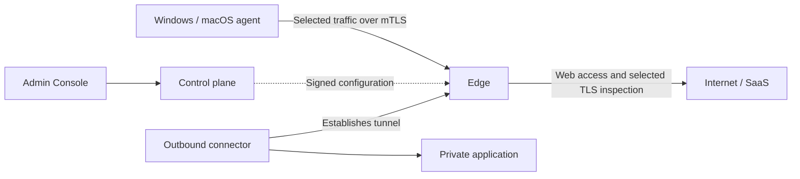

# Lantern DSSE

**Self-hosted network access and web inspection, with policies you can inspect in source.**

Lantern DSSE is an open-source Secure Service Edge (SSE / ZTNA) implementation for
self-hosted labs. Connect Windows and macOS devices to an Edge, inspect selected web
traffic, and reach private applications through outbound connectors. Configure customer
organizations and policies in the Admin Console.

Developed by [Lantern Networks, Inc.](https://lantern-networks.co.jp/).
This is the official `dsse-core` source repository, licensed under [Apache-2.0](LICENSE).
[Company information](https://lantern-networks.co.jp/company/).

[Try the local API](docs/getting-started.md) · [Deploy a lab](docs/deployment.md) ·
[Download signed agents](https://github.com/lantern-networks/dsse-core/releases) ·
[Read the docs](docs/README.md)

**This is an experimental release, not production-ready.** Interfaces, defaults, and configuration may
change without a migration path. Use an isolated lab with recoverable devices and data.
A successful installation check is not evidence of long-duration reliability or of a
security audit. It has not been independently run at length by anyone who did not write it.
See the [threat model](docs/threat-model.md) and each platform's limitations.

## What can you explore?

| Your question | What to try in DSSE |
|---|---|
| What sensitive content might devices send to an AI or web service? | Attach an **Observe** DLP policy to inspected web traffic and check the corresponding detections in **DLP Findings**. Observe permits the upload. [DLP guide](docs/dlp.md) |
| Can I restrict which organization accounts people use in supported SaaS services? | Configure provider-specific restriction headers for Google Workspace, Microsoft 365, ChatGPT, or Anthropic Claude. The request must be inspected, and enforcement depends on the provider. [SaaS tenant restriction](docs/saas-tenant-restriction.md) |
| How can enrolled devices reach a private application? | Publish it through an outbound connector, configure access policy, and verify the result from an enrolled device. [Connector guide](docs/connector.md) |

DLP inspects supported upload bodies that reach the decrypted HTTP path. It does not
cover every protocol or every AI application. SaaS providers start with account
restrictions **off**; configuring a provider is separate from configuring DLP.

## How it fits together



The Edge handles traffic and policy decisions. The control plane distributes configuration;
connectors establish outbound tunnels from the private network. The diagram shows roles,
not a complete deployment topology. See [Architecture](docs/architecture.md) for the data
paths and [PKI](docs/pki.md) for device identity and certificate lifecycle.

## Choose your first step

- **Explore the code locally:** the [local API quickstart](docs/getting-started.md) runs
  one Edge on loopback and lets you query its policy API. It does not install an agent,
  steer your browser, or demonstrate DLP.
- **Evaluate the system:** follow [Deployment](docs/deployment.md), then enrol a device.
  The guide includes a single-machine lab and three regions with one node each.
  Signed Windows and macOS packages, checksums, and release limitations are in
  [GitHub Releases](https://github.com/lantern-networks/dsse-core/releases).

Use the [verification guide](docs/verification.md) to distinguish a successful setup
step from a working end-to-end flow.

## Install and start a deployment

Follow these pages in order. All commands use this repository's root, where `go.mod`,
`cmd/`, `deploy/`, and `schemas/` live.

1. [Deployment](docs/deployment.md): prerequisites, build, plan, start, bootstrap the
   administrator, and verify. Includes plans for **three regions with one node each**
   and for a single-machine lab.
2. [First use](docs/after-verify.md): trust the Console certificate, sign in with MFA,
   and prepare the first customer organization.
3. [Organizations](docs/organizations.md): configure its authorities and policies,
   then obtain a signed device profile and one-time enrolment token.
4. Install an endpoint: [Windows](docs/windows-agent.md) or [macOS](docs/macos-agent.md).
   Both require a suitable signed package; source code alone does not supply signing identities.
5. [Connectors](docs/connector.md): publish a private application and test access from
   the enrolled endpoint.

Completion means the deployment checks pass, the administrator can sign in, and a real
endpoint passes its local verifier and can reach an allowed application. Review every
failed or unanswered check. Verify a denied flow as well before relying on a policy.

For a smaller code demonstration, the [local API quickstart](docs/getting-started.md)
runs one Edge on loopback. It is **not a deployment** and does not install an endpoint.

## Architecture and operations

| Guide | Contents |
|---|---|
| [Architecture](docs/architecture.md) | Control plane, Edge, identity, inspection, and configuration distribution |
| [PKI](docs/pki.md) | CA structure, key custody, automatic renewal, and operator-managed rotation |
| [IdP integration](docs/idp.md) | Customer sign-in, claims, TLS, and current assurance limits |
| [Egress policy](docs/egress-policy.md) | Internet Access rules, inspection, bypass, DLP, and verification |
| [East-West policy](docs/east-west-policy.md) | Internal access, enforcement stages, and out-of-band step-up |
| [DLP](docs/dlp.md) | Upload detectors, policy attachment, actions, and coverage limits |
| [Administration](docs/administration.md) | Roles, customer delegation, elevation, and recovery authority |
| [Audit and data](docs/audit-and-data.md) | Evidence, delivery, retention, exports, and data handling |
| [Release overview](docs/release-overview.md) | Evaluation scope, defaults, limitations, and release evidence status |
| [Building](docs/building.md) | Service images, native binaries, and endpoint packaging prerequisites |
| [Operator tools](docs/operator-tools.md) | Verify profiles and signing keys; sign update manifests |
| [Agent updates](docs/agent-updates.md) | Publish signed packages to enrolled devices |
| [Operations](docs/operations.md) | Routine checks, change control, state, and recovery preparation |
| [Troubleshooting](docs/troubleshooting.md) | Diagnose deployment, endpoint, policy, and update failures |
| [Egress broker](egress-broker/README.md) | Optional curl-impersonate transport; the standard deployment uses Go HTTP/TLS |

The policy evaluator is default-deny. The Console's initial organization policy can
explicitly allow and inspect all traffic, and connector access starts in OBSERVE mode;
[review these defaults](docs/organizations.md#what-the-organization-carries-from-the-moment-it-exists)
as part of setup.

## Use as a Go library

```sh
go get github.com/lantern-networks/dsse-core/...
```

Packages include `policy`, `decision`, `swg`, `inspection`, `tenantca`, `revocation`,
`dnsresolver`, and `connector`. From a checkout:

```sh
go build ./...
go test ./...
```

The [egress broker](egress-broker/README.md) is a nested module with native dependencies;
these commands do not build or test it. Platform-specific endpoint builds are described
in [Building](docs/building.md).

## Contributing and security

Trying DSSE in an independent lab is a useful contribution. Tell us what you tried,
which release and platform you used, and where the instructions or behavior differed
from your expectations. [Open an issue](https://github.com/lantern-networks/dsse-core/issues)
with sanitized details; keep tokens, private keys, and personal data out of reports.

See [CONTRIBUTING.md](CONTRIBUTING.md) for the Developer Certificate of Origin and
contribution checks. Report vulnerabilities privately using [SECURITY.md](SECURITY.md).

## Licensing behavior

With no vendor keys configured, the deployment has no licence-based seat limit. A signed
licence, when configured, declares a certified scope and may refuse new enrolments beyond
that scope. It must not stop existing traffic, halt an Edge, or disable features.
The source is available under Apache-2.0, including this logic.

## License

[Apache-2.0](LICENSE). Native components used by the egress broker have additional licence
terms; see [THIRD-PARTY.md](egress-broker/THIRD-PARTY.md) and the licence texts it links.
