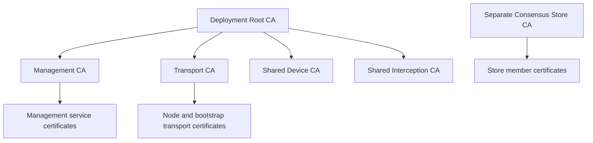
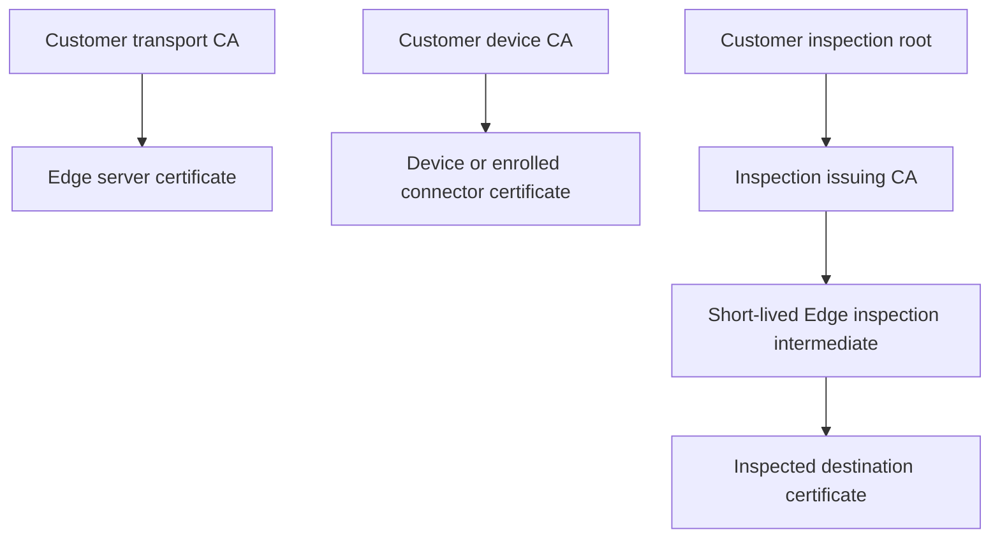

# PKI structure and lifecycle

This describes the current source and the deployment generated by `dsse-install`.
DSSE is experimental. CA hierarchies, key custody, defaults, APIs, and migration
procedures may change, including changes that require operator action. Use this
guide from the revision you deploy; it is not a promise of future compatibility.
Imported authorities and manually configured deployments can have different chains.

## What each authority proves

There is more than one trust domain. A customer's inspection root is not the root
for every deployment service, and trusting an Edge server does not identify a device.

| Authority or signing identity | Purpose | Verifier |
|---|---|---|
| Deployment Management CA | Management service identities | Administrative clients and services |
| Deployment Transport CA | Bootstrap and node/service transport identities | Deployment peers and bootstrap clients |
| Customer transport CA | Customer-facing Edge server identity | That customer's agents and connectors |
| Customer device CA | Enrolled device/client identity | Edge admission and renewal handlers |
| Customer inspection CA hierarchy | Certificates for inspected HTTPS destinations | Endpoint OS and application trust stores |
| Consensus Store CA | Store member TLS identities | Consensus store members |
| Configuration/profile/policy signing key | Authentic configuration and trust distribution | DSSE components with the signing public key pinned |
| Agent update signing key | Authentic update manifests | Endpoint update verifier |

The last two are payload signatures, not CA certificates in the TLS chain. Platform
package signing and license verification have separate keys and purposes as well.
A configuration signature alone does not establish tenant isolation: tenant scope,
the selected authority, and admission checks must also agree.

## Current certificate structure

The installer creates this deployment/bootstrap hierarchy. The shared Device and
Interception CAs still exist; do not mistake them for each customer's independent CA.

Customer authorities managed by the control plane have a different shape. The
following repeats for each customer; the customer roots are not automatically
subordinate to the deployment root.

For managed customer authorities, the transport and device CAs are self-signed.
Inspection can use an authority generated by the control plane or an imported
customer root certificate plus a delegated issuing certificate and its private key.
The import does not require the customer's root private key. A registered external
device CA certificate permits verification of externally issued identities; the
certificate alone cannot issue a new identity for a one-time enrolment token.

## Where private keys are held

**The generated deployment does not configure SoftHSM or an HSM signing sidecar.**
Its default custody uses files and control-plane authority stores. The generated
control plane uses PostgreSQL for the customer transport, device, and inspection
authority stores. Those stores contain private-key material, not just certificates.

| Material | Current custody and boundary |
|---|---|
| Deployment root, Management CA, Transport CA, and installer signing keys | Installer `authority/` directory; excluded from generated runtime mounts and machine carry packages |
| Consensus Store CA key | Installer `authority/`; member certificates and keys travel to store nodes |
| Shared Device and Interception CA keys | Runtime file-based signing paths remain in the generated deployment |
| Customer transport CA key | Control-plane durable authority store; Edge receives server certificate and private key |
| Managed customer device CA key | Control-plane durable store **and the CA private key delivered to Edge** for enrolment signing |
| Customer inspection issuing key | Control-plane durable store; Edge receives a separate short-lived intermediate certificate and private key |
| Configuration/profile/policy signing key | Runtime signing material in the default file-based configuration |
| Agent update manifest signing key | Separate signing identity; generated private key is retained under `authority/` for publishing updates |

The customer device material's default 12-hour lease is a software deadline. It
does **not** turn its five-year CA certificate into a 12-hour intermediate or make
an exported CA key cryptographically unusable after 12 hours. Inspection uses an
actual short-lived intermediate certificate instead. Filesystem permissions,
database access, backups, and access to Edge memory therefore matter to key custody.
An unmounted installer directory is not automatically an offline hardware vault.

The Edge inspection intermediate is also persisted for restart recovery. Its key
is sealed when an interception key-encryption key (KEK) is configured; that helper
stores PEM without sealing when no KEK is configured. Check the deployed settings
and preserve the matching KEK when recovering sealed material.

The managed inspection minting routine returns the root certificate and the issuing
certificate/key; it does not retain or return the generated root private key. Do not
assume an offline copy exists for later re-signing of that issuing CA. Plan authority
replacement before the issuer expires. With an externally managed root, the root
owner can supply a replacement delegation under that retained root.

### Optional HSM integration

The source includes `dsse-hsm-agent` and PKCS#11 signing paths, including the
`-interception-hsm-agent-socket`, `-device-ca-hsm-agent-socket`, and
`-agent-policy-hsm-agent-socket` options. Having that code or a token installed does
not mean a running signer uses it. Inspect the running role, its signer selection,
key identity, and an actual signing/readiness result.

SoftHSM is a software token, so its use must not be described as hardware protection.
These options do not automatically migrate the customer authority stores to HSM
custody. Moving an established signing key or introducing a new key also needs a
trust-distribution and recovery plan. No HSM deployment or migration is performed
by the ordinary generated setup described above.

## What renews automatically

Defaults below describe issuance in the current code, not a guarantee of remaining
validity. Always inspect the actual certificate and its entire chain: a child
certificate cannot extend an expired parent's validity.

| Material | Current default | Renewal responsibility |
|---|---|---|
| Customer Edge transport certificate | 12 hours | Edge fetches replacement material from the control plane |
| Customer Edge inspection intermediate | 12 hours | Same authenticated material-refresh loop |
| Managed customer device signing material | 12-hour lease; underlying CA is five years | Same refresh loop; this refresh does not itself rotate the CA |
| Enrolled device certificate | 60 days (`-enroll-cert-ttl`) | Windows/macOS agents renew at two-thirds of actual certificate lifetime |
| Installer-managed enrolled connector identity | Enrolment certificate lifetime | Connector renews at two-thirds; operator-supplied certificate files are not automatically enrolled into this loop |
| Installer-issued node/service leaf certificates | One year | Operator reissues and applies replacement; no general automatic reissuance loop |
| Store member certificates | Five years | Operator replacement |
| Deployment/bootstrap CAs and Store CA | Installer `-years`, default ten years | Operator lifecycle management |
| Managed customer transport CA | Ten years | Operator-driven CA rotation |
| Managed customer device CA | Five years | Operator-driven CA rotation |
| Managed customer inspection root / issuing CA | Five / two years | Operator-driven authority renewal or replacement |

Edge material is obtained over authenticated TLS using the node's client identity
and authorization credential at `/tenant-edge-material`. The refresh loop normally
checks once per minute; unchanged material is not reissued every minute. Renewal
becomes due at two-thirds of the installed material's remaining lifetime, and a
changed authority generation can trigger an earlier refresh. Failed requests retry
with bounded backoff. An independent expiry check prevents a stalled fetch from
extending validity: expired transport identities are not served, and exhaustion of
the known transport identities takes the node out of service.

This depends on the node's own control-plane client certificate. The code warns in
its last 14 days, but does not renew it automatically. Expiry can stop material
refresh, audit shipping, and revocation synchronization. TLS file reload support
only loads replacement files; it does not obtain a new certificate from an issuer.

Windows and macOS renewal creates a new identity and checks it before activation.
The previous identity can remain as a fallback, so both current and fallback
certificates matter when retiring a CA. An operator can request earlier renewal
through the signed renewal cutoff (`/admin/device-certificates/renew-all`). This
requests client work; it is not proof that every device has already renewed.

## CA rotation and retirement

Renewing a leaf under the same CA usually needs no new root on the endpoint.
Replacing a CA or a signing public key changes what clients must trust.

1. Inventory the current chain, expiration dates, key custody, affected customers,
   active regions, endpoints, connectors, and recovery routes.
2. Introduce the replacement using the operation for that authority. For customer
   transport and inspection authorities, announce the incoming trust before
   promoting it for use. Managed device CA rotation starts issuing under the new
   CA while retaining admission under the old CA.
3. Confirm distribution and fresh adoption reports. A saved configuration, an Edge
   applying it, and an endpoint adopting it are separate events. Check the expected
   trust serial, fingerprint, and server name, not just a device count.
4. Exercise new connections and identity renewal in each affected region. Check
   Windows, macOS, connectors, and applications with their own CA bundles. An OS
   trust report does not prove an already-running application has reloaded trust.
5. Retire old trust only when the authority's readiness checks permit it and the
   affected identities, including fallbacks and offline devices, are accounted for.
   Keep recovery material and evidence appropriate to the transition.

Transport/inspection promotion and device-CA rotation have different semantics;
do not apply one authority's sequence to another. Abandoning a device-CA rotation
also cannot simply discard trust in certificates already issued by the new CA.
Removing an old anchor before adoption can disconnect the channel needed to repair
the client. Offline or stale reports are unresolved evidence, not successful adoption.

## Expiry, revocation, and recovery

Normal admission requires a valid, enrolled, non-revoked identity. Expiry and an
explicit administrative revocation are different conditions. DSSE uses admission
and revocation state; do not assume universal browser CRL/OCSP enforcement.

An optional renewal recovery route can accept an expired identity solely for
renewal within its configured grace window (default 30 days), while checking its
chain, enrolment, and revocation state. The standalone grace listener is disabled
by default; generated recovery routing and the client's configured recovery names
must be checked for the deployed revision. It does not relax ordinary traffic
mTLS or restore arbitrary retired trust. A revoked identity does not become valid
because it is in the grace period.

Before recovery, establish whether the failure is an expired leaf, an expired
issuer, a missing trust anchor, a rejected identity, a missing signing key, or an
unreachable control plane. Re-enrolment may be necessary when the supported
recovery path no longer applies. Restoring certificates alone is insufficient if
the keys, authoritative enrolment/revocation state, or trust-distribution state
needed to use them are missing.

## Operator checks and implementation references

Use the Console certificate inventory and the authenticated
`GET /admin/pki/certificates` and `GET /admin/pki/readiness` views to examine the
current state. Check the signer as well as the certificate file; a certificate can
remain valid when the private key is unavailable. Record pending migrations and
the earliest parent/node expiry alongside short-lived material renewal.

The remaining operator-managed lifecycles and file/store custody above are current
limitations. This guide does not claim HSM coverage, automatic renewal of every CA,
or successful endurance and recovery testing. See [Operations](operations.md) and
[Verification](verification.md) for the separate evidence required.

Source entry points for checking a changed revision:

- [Installer issuance](../cmd/dsse-install/main.go), [authority separation](../cmd/dsse-install/the_authority_is_not_a_runtime_possession.go), and [store authority](../cmd/dsse-install/the_store_has_its_own_authority.go).
- [Customer transport authority](../cmd/dsse-edge/tenant_transport_material_authority.go), [device authority](../cmd/dsse-edge/tenant_device_material_authority.go), [inspection authority](../cmd/dsse-edge/tenant_interception_material_authority.go), and [managed inspection minting](../cmd/dsse-edge/tenant_interception_authority_mint.go).
- [Edge material refresh and expiry](../cmd/dsse-edge/tenant_transport_material_fetch.go), [trust distribution](../cmd/dsse-edge/tenant_trust_distribution.go), and [PKI readiness](../cmd/dsse-edge/admin_pki_readiness.go).
- [Device renewal timing](../enroll/renewal_due.go), [connector identity](../cmd/dsse-connector/identity.go), and [signer options](../cmd/dsse-edge/main.go).

## Trusting certificates for internal sites

Open **Internal site certificates** in the control-plane Console. Add a recognizable
name and the public CA certificate that issued the internal site's certificate.
Paste exactly one PEM `CERTIFICATE` block per entry. Do not paste a private key,
a certificate chain, or the site's leaf certificate. This authority is separate
from the inspection CA that your devices trust.

The list belongs to the selected organization. A successful addition lets its
upstream TLS connections use that CA alongside the platform's public roots. It does
not add trust for another organization. Expired authorities remain visible but are
excluded from the trust material. Removing an authority requires confirmation;
private sites that rely on it may stop opening after the change reaches the
serving Edge. Established connections are not forcibly closed by this operation.

Additions, replacements and deletions change live trust only after the storage
operation reports success. A storage error is shown as a failure, not a completed
removal. Restore storage, reload the list and retry. The Console keeps the same
request ID when retrying unchanged input after an uncertain response. A remote
storage error can leave the durable outcome uncertain; recheck the list instead
of assuming the storage operation rolled back. Nodes that receive configuration
from a source reject local writes; make the change on the control plane.

Malformed stored records or configuration sections are rejected as a whole;
reload keeps the last valid list. If an older stored entry contains mixed PEM
material, correct it to one public CA certificate through a controlled maintenance
procedure before loading it with this version. This validation does not remove
private keys from old database backups or previously distributed copies.

**Logs & Audit** records `admin_internal_ca_changed` with the administrator,
organization, authority ID, action and result. Results include `saved`, `deleted`,
`rejected`, `not_found`, and `persistence_unconfirmed`. Addition attempts can include
a SHA-256 certificate fingerprint; certificate PEM, private keys and display names
are not copied into this event. The common configuration-change audit also records
the HTTP outcome. Fleet propagation and storage/audit durability require deployment
verification in addition to a successful Console response.

### Importing and replacing a tenant interception CA

In **Certificates**, use **Load this tenant's interception CA** for the first import.
Provide the public root certificate, the issuing CA certificate and its matching
issuing private key. Keep the root private key offline. Devices must trust the root
before inspection, and each Edge receives the saved authority on its next refresh.

Once an authority exists, **Stage a replacement CA** registers the next authority.
The current authority continues signing while devices adopt the incoming root.
The Console disables another import while a replacement is staged. Switch only
after the adoption checks permit it. Missing fleet evidence prevents promotion
and withdrawal; saving the replacement alone does not complete the rotation.
If saving fails, reload the authority state after restoring storage before retrying.

**Logs & Audit** records successful first imports and staged replacements as
`pki_material_changed`, including the organization, administrator, root and issuing
certificate fingerprints, and whether the import was staged. The common audit
records rejected requests. Device CA registration records the submitted public
certificate fingerprints and its reported durability. No private key is included
in these audit records. Audit delivery and fleet adoption need separate verification.

## Replacing a node certificate from the Console

In **Certificates**, select **Replace** for the intended node and supply its leaf
certificate chain and matching private key. This changes that node's registered
listener files; it is not a fleet-wide CA rotation. The current trust/admission
checks still apply to replacements and rollbacks.

Before changing the files, the server must save the currently served pair in the
control-plane version store. This includes the original pair on the first
replacement. If versioning is unavailable or that save fails, the request is
refused and the replacement is not applied. **History / roll back** lists versions
without their private-key payload; choosing a version restores its certificate
and key after validating them against current trust. The internal version store
contains private keys and needs the same access and backup protections as other
PKI stores. A failed replacement can still leave a retained copy of the unchanged
previous pair in history.

Both destination files must be writable regular files. New material is staged
before changing either file. A private recovery journal beside the certificate
(`CERT_PATH.dsse-pair-recovery.json`) durably retains the previous pair before
replacement. If the process terminates before the update is confirmed, startup
and reload restore that pair before loading it. Recovery is retryable if it is
interrupted again. A malformed or inaccessible recovery journal prevents loading
or updating that pair; an already-running listener keeps its last loaded pair.

Keep the recovery journal with its backing files and protect it like a private
key. After completion its contents become a durable marker without key material.
Do not delete a pending journal or edit the backing files while recovering. If
recovery fails, correct the storage problem and retry reload/startup. Separate
processes must not share writable certificate files. This is recovery for the
Console's file-pair update, not an atomic transaction with the version database
or a guarantee about storage hardware surviving a power failure. A commit whose
durability could not be confirmed is reported as a failure; reload and inspect
the served fingerprint before retrying.

## Interrupted device-CA withdrawal on combined nodes

On a node that both authors CA registrations and enforces device trust, withdrawing
one CA changes two separate stores. A `500` partial response does not confirm that
the CA has stopped admitting devices. Keep the original tenant and fingerprint,
restore storage, and retry the same single-anchor DELETE before restarting.
While that withdrawal is unfinished, other CA registration changes return `503`;
a tenant-wide attribution deletion cannot finish a single-anchor trust removal.

For a file-backed author, the registry now saves a `pending_withdrawals` record
before changing attribution or device trust. If this first save cannot be
confirmed, a new withdrawal returns `503` with `applied: false`; neither live
attribution nor trust is changed. A retry of an already-applied partial withdrawal
continues to report that partial state. A recovery record can be present on disk
even when its save returned an error. The same operation remains retryable in the
running process. Only completion of the trust stage and the final registry save
removes the record. Writes use flushed temporary files and durable replacement;
filesystems that cannot confirm replacement are treated as failures.

If the process stops with a pending record, startup refuses to load that registry,
including when it is used as a config-pulling Edge's cache. Importing that snapshot
also refuses it. This prevents an old saved attribution from silently returning
to service. It does not replay the withdrawal automatically. Keep all writers and
device serving stopped, preserve both stores and the failed operation's records,
and reconcile the named tenant and certificate with authoritative ownership.
For a single-anchor withdrawal, the completed state must exclude that certificate
from both attribution and device trust. When the saved trust set changes, advance
its distribution serial once above the saved value and preserve the other
distribution metadata; devices must not receive a changed set under an unchanged
serial. Keep the pending record through intermediate saves and verify the saved
certificate fingerprints and serial before clearing it. A tenant-wide attribution deletion does
not itself remove device trust. Preserve unrelated tenants and anchors. Remove
the pending record only after both saved stores have been reconciled and their
writes confirmed, then verify the loaded state before returning to service. If
the operation or ownership is uncertain, retain the record and leave serving
stopped. Do not simply delete the record or downgrade to a reader that ignores it.

Shared paths outside the pure control-plane transactional author (including
combined enforcement nodes using shared persistence) still retain only a
process-local withdrawal receipt. Their
last saved registry may restore the old attribution on restart. Keep such nodes
out of device-serving traffic during reconciliation; do not treat a lost pending
flag or a `404` as proof that device trust was removed. If the original CA remains
attributed to its verified original tenant, restore the withdrawal prerequisites
and retry the same DELETE, then inspect both saved stores and the success audit.

The file record is a startup interlock, not an atomic update across both stores
or a guarantee of fleet propagation. Automatic restart recovery, weak-backend
receipt durability, and recovery from an unknown database commit remain separate
boundaries. The transactional shared-authority path is unchanged.

## Ambiguous device-CA ownership at startup

A CA certificate may belong to only one tenant. Startup rejects a registry that
assigns the same certificate to different tenants, whether the earlier entry uses
a PEM file or inline `ca_pem`. The file remains unchanged. A malformed existing
registry is not treated as an absent cache on a config-pulling Edge, so the node
stops rather than accepting an ambiguous tenant mapping.

Keep that node out of service, preserve the rejected registry, and reconcile its
entries with authoritative ownership records. Do not choose the last entry or
reassign a CA just to make startup pass. Restore a consistent registry through
the deployment's controlled maintenance procedure, then verify the owning tenant
before serving devices. This check does not persist an interrupted withdrawal's
pending receipt; the separate recovery procedure above still applies.
